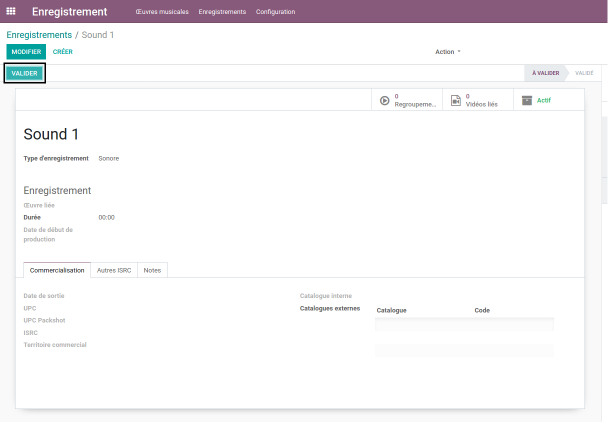

Recording Status
=========
This module contains the status for the recording application.

.. contents:: Table of Contents

Recordings
~~~~~~~~~~
This menu item is available to members of the group ``Recording / User``.

.. image:: static/description/recording_list.png

By clicking on a recording, the form view is opened.

.. image:: static/description/recording_form.png

Configuration
~~~~~~~~~~~~~
This menu is available to members of the group ``Recording / Manager``.

It contains relevant configuration objects for the application.

When installing only the recording application any optional addon,
it contains the following submenus.

Button
*********
This button  allows to validate status of recording.

Contributors
------------
* Numigi (tm) and all its contributors (https://bit.ly/numigiens)

More information
----------------
* Meet us at https://bit.ly/numigi-com
